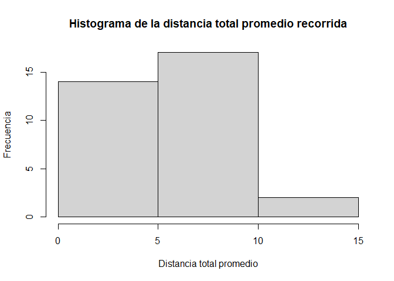
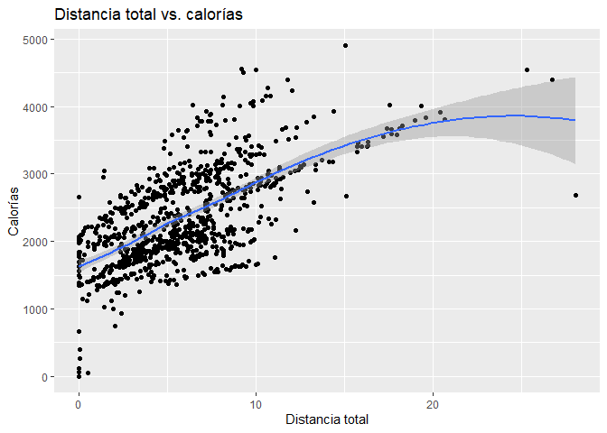
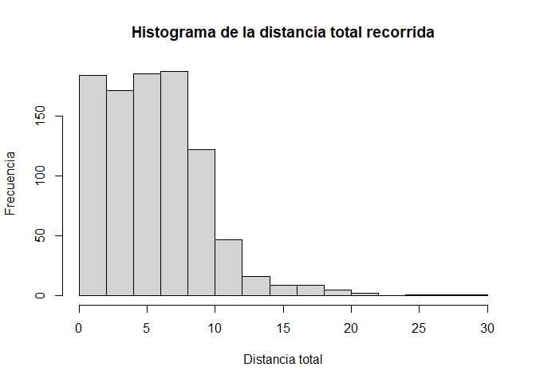

---
output:
  word_document: default
  html_document: default
---
Caso de estudio BellaBeat
================
Gabriela Pinilla
2023-07-08

\# Caso de estudio de Bellabeat

\## Acerca de la empresa

La compañía Bellabeat es una empresa dedicada a fabricar productos
dirigidos a la salud de la mujer fundada por Urška Sršen y Sando Mur en
2013. A través de los diferentes productos que ofrece, recopila datos
como la actividad física, el sueño, estrés, lo cual le permite a la
compañía entregar información a las mujeres sobre su salud y hábitos.

El objetivo del caso es analizar los datos de la actividad física de los
dispositivos inteligentes que no pertenecen a Bellabeat para mejorar la
estrategia de marketing de la empresa.

## Tarea empresarial

Identificar tendencias de uso de los dispositivos inteligentes y, a
partir de estas, generar recomendaciones para mejorar la estrategia de
marketing de Bellabeat.

## Fuentes de datos

El conjunto de datos usada para este caso es FitBit Fitness Tracker
Data, de dominio público y disponible en kaggle
\[<https://www.kaggle.com/datasets/arashnic/fitbit>\] por Möbius.
Contiene información de la actividad física de treinta usuarios, como la
intensidad del a actividad a realizar, el sueño, ritmo cardíaco y pasos.
Los datos están organizados en tablas donde cada usuario posee un ID,
fecha y hora en que realizó la actividad y los datos obtenidos por medio
de la encuesta distribuida por Amazon Mechanical Turk entre el 12 de
marzo de 2016 y 12 de mayo del mismo año.

Existen dos limitaciones con respecto a los datos. La primera se debe a
que el tamaño de la muestra es de treinta usuarios, lo que pone en duda
que la muestra sea representativa de la población. La segunda es que la
última actualización de los datos fue en 2021, sin embargo, el conjunto
de datos previamente visualizado en Excel posee la información necesaria
para identificar una tendencia sobre el uso de dispositivos
inteligentes.

## Procesamiento de datos

### Instalación de paquetes

Para el análisis del caso, se trabajará en Excel para visualizar los
datos sin limpiar y en R para hacer la limpieza, procesamiento y
posteriores visualizaciones.

Se usarán los siguientes paquetes para el análisis:

- tidyverse
- lubridate
- readr
- tidyr
- ggplot2
- dplyr

``` r
library(readr)
library(tidyverse)
```

    ## ── Attaching packages ─────────────────────────────────────── tidyverse 1.3.2 ──
    ## ✔ ggplot2 3.4.0      ✔ dplyr   1.0.10
    ## ✔ tibble  3.1.8      ✔ stringr 1.4.1 
    ## ✔ tidyr   1.2.1      ✔ forcats 0.5.2 
    ## ✔ purrr   0.3.5      
    ## ── Conflicts ────────────────────────────────────────── tidyverse_conflicts() ──
    ## ✖ dplyr::filter() masks stats::filter()
    ## ✖ dplyr::lag()    masks stats::lag()

``` r
library(lubridate)
```

    ## Loading required package: timechange
    ## 
    ## Attaching package: 'lubridate'
    ## 
    ## The following objects are masked from 'package:base':
    ## 
    ##     date, intersect, setdiff, union

``` r
library(tidyr)
library(ggplot2)
library(dplyr)
```

### Fuentes de datos

Los conjuntos de datos que se importarán para resolver el caso
corresponden a medidas diarias:

- dailyActivity

- dailyCalories

- dailyIntensities

- sleepDay

Junto con importarlos, se ajustará la fecha de cada uno para que
mantengan el mismo formato en todos los conjuntos.

``` r
# Actividad
actividad <- read_csv("C:\\Users\\gabri\\Documents\\Bellabeat\\dailyActivity_merged.csv")
```

    ## Rows: 940 Columns: 15
    ## ── Column specification ────────────────────────────────────────────────────────
    ## Delimiter: ","
    ## chr  (1): ActivityDate
    ## dbl (14): Id, TotalSteps, TotalDistance, TrackerDistance, LoggedActivitiesDi...
    ## 
    ## ℹ Use `spec()` to retrieve the full column specification for this data.
    ## ℹ Specify the column types or set `show_col_types = FALSE` to quiet this message.

``` r
# Calorias
calorias <- read_csv("C:\\Users\\gabri\\Documents\\Bellabeat\\dailyCalories_merged.csv", col_types = cols(ActivityDay = col_date(format = "%m/%d/%Y")))

# Intensidad
intensidad <- read_csv("C:\\Users\\gabri\\Documents\\Bellabeat\\dailyIntensities_merged.csv", col_types = cols(ActivityDay = col_date(format = "%m/%d/%Y")))

# Sueño
sueno <- read_csv("C:\\Users\\gabri\\Documents\\Bellabeat\\sleepDay_merged.csv", col_types = cols(SleepDay = col_datetime(format = "%m/%d/%Y %H:%M:%S %p")))
```

### Previsualización

Antes de iniciar con la limpieza, se hará una vista previa de cada
conjunto de datos.

``` r
head(actividad)
```

    ## # A tibble: 6 × 15
    ##       Id Activ…¹ Total…² Total…³ Track…⁴ Logge…⁵ VeryA…⁶ Moder…⁷ Light…⁸ Seden…⁹
    ##    <dbl> <chr>     <dbl>   <dbl>   <dbl>   <dbl>   <dbl>   <dbl>   <dbl>   <dbl>
    ## 1 1.50e9 4/12/2…   13162    8.5     8.5        0    1.88   0.550    6.06       0
    ## 2 1.50e9 4/13/2…   10735    6.97    6.97       0    1.57   0.690    4.71       0
    ## 3 1.50e9 4/14/2…   10460    6.74    6.74       0    2.44   0.400    3.91       0
    ## 4 1.50e9 4/15/2…    9762    6.28    6.28       0    2.14   1.26     2.83       0
    ## 5 1.50e9 4/16/2…   12669    8.16    8.16       0    2.71   0.410    5.04       0
    ## 6 1.50e9 4/17/2…    9705    6.48    6.48       0    3.19   0.780    2.51       0
    ## # … with 5 more variables: VeryActiveMinutes <dbl>, FairlyActiveMinutes <dbl>,
    ## #   LightlyActiveMinutes <dbl>, SedentaryMinutes <dbl>, Calories <dbl>, and
    ## #   abbreviated variable names ¹​ActivityDate, ²​TotalSteps, ³​TotalDistance,
    ## #   ⁴​TrackerDistance, ⁵​LoggedActivitiesDistance, ⁶​VeryActiveDistance,
    ## #   ⁷​ModeratelyActiveDistance, ⁸​LightActiveDistance, ⁹​SedentaryActiveDistance

``` r
head(calorias)
```

    ## # A tibble: 6 × 3
    ##           Id ActivityDay Calories
    ##        <dbl> <date>         <dbl>
    ## 1 1503960366 2016-04-12      1985
    ## 2 1503960366 2016-04-13      1797
    ## 3 1503960366 2016-04-14      1776
    ## 4 1503960366 2016-04-15      1745
    ## 5 1503960366 2016-04-16      1863
    ## 6 1503960366 2016-04-17      1728

``` r
head(intensidad)
```

    ## # A tibble: 6 × 10
    ##           Id ActivityDay Seden…¹ Light…² Fairl…³ VeryA…⁴ Seden…⁵ Light…⁶ Moder…⁷
    ##        <dbl> <date>        <dbl>   <dbl>   <dbl>   <dbl>   <dbl>   <dbl>   <dbl>
    ## 1 1503960366 2016-04-12      728     328      13      25       0    6.06   0.550
    ## 2 1503960366 2016-04-13      776     217      19      21       0    4.71   0.690
    ## 3 1503960366 2016-04-14     1218     181      11      30       0    3.91   0.400
    ## 4 1503960366 2016-04-15      726     209      34      29       0    2.83   1.26 
    ## 5 1503960366 2016-04-16      773     221      10      36       0    5.04   0.410
    ## 6 1503960366 2016-04-17      539     164      20      38       0    2.51   0.780
    ## # … with 1 more variable: VeryActiveDistance <dbl>, and abbreviated variable
    ## #   names ¹​SedentaryMinutes, ²​LightlyActiveMinutes, ³​FairlyActiveMinutes,
    ## #   ⁴​VeryActiveMinutes, ⁵​SedentaryActiveDistance, ⁶​LightActiveDistance,
    ## #   ⁷​ModeratelyActiveDistance

``` r
head(sueno)
```

    ## # A tibble: 6 × 5
    ##           Id SleepDay            TotalSleepRecords TotalMinutesAsleep TotalTim…¹
    ##        <dbl> <dttm>                          <dbl>              <dbl>      <dbl>
    ## 1 1503960366 2016-04-12 00:00:00                 1                327        346
    ## 2 1503960366 2016-04-13 00:00:00                 2                384        407
    ## 3 1503960366 2016-04-15 00:00:00                 1                412        442
    ## 4 1503960366 2016-04-16 00:00:00                 2                340        367
    ## 5 1503960366 2016-04-17 00:00:00                 1                700        712
    ## 6 1503960366 2016-04-19 00:00:00                 1                304        320
    ## # … with abbreviated variable name ¹​TotalTimeInBed

### Documentación de limpiezas

Se buscarán datos duplicados.

``` r
nrow(actividad[duplicated(actividad), ])
```

    ## [1] 0

``` r
nrow(calorias[duplicated(calorias), ])
```

    ## [1] 0

``` r
nrow(intensidad[duplicated(intensidad), ])
```

    ## [1] 0

``` r
nrow(sueno[duplicated(sueno), ])
```

    ## [1] 3

Posteriormente, se buscará la existencia de datos nulos.

``` r
sum(is.na(actividad))
```

    ## [1] 0

``` r
sum(is.na(calorias))
```

    ## [1] 0

``` r
sum(is.na(intensidad))
```

    ## [1] 0

``` r
sum(is.na(sueno))
```

    ## [1] 0

Se procederá a eliminar los datos duplicados del conjunto de datos
sueño.

``` r
# Eliminar datos duplicados del conjunto sueno
sueno <- distinct(sueno)
```

Finalmente, se verificará si los datos duplicados fueron eliminados.

``` r
nrow(sueno[duplicated(sueno), ])
```

    ## [1] 0

Luego de limpiar los datos, se calculará la cantidad de participantes de
cada conjunto de datos formando tablas de frecuencias con el Id y
sumando la cantidad de filas.

``` r
nrow(table(actividad$Id))
```

    ## [1] 33

``` r
nrow(table(calorias$Id))
```

    ## [1] 33

``` r
nrow(table(intensidad$Id))
```

    ## [1] 33

``` r
nrow(table(sueno$Id))
```

    ## [1] 24

La cantidad de participantes es de 33 en actividad, calorías e
intensidad, y 24 en sueño.

## Análisis

La Organización Mundial de la Salud recomienda caminar 7 kilómetros
diarios, lo que equivale a diez mil pasos para reducir el riesgo de
padecer problemas cardiovasculares, obesidad, diabetes, depresión y
otros síntomas que produce el sedentarismo. De esta forma, una persona
sedentaria camina entre tres mil y cuatro mil pasos diarios, lo que
corresponde a 2,5 y 3 kilómetros.

``` r
pasos <- actividad %>%
  group_by(Id) %>%
  select(Id, TotalSteps, TotalDistance, SedentaryMinutes, Calories) %>%
  summarise(media.TotalSteps = mean(TotalSteps, na.rm = TRUE), media.TotalDistance = mean(TotalDistance, na.rm = TRUE), media.SedentaryMinutes = mean(SedentaryMinutes, na.rm = TRUE), media.Calories = mean(Calories, na.rm = TRUE))
muestra1 <- pasos %>% filter (media.TotalSteps >= 10000)
muestra2 <- pasos %>% filter (media.TotalSteps < 10000 & media.TotalSteps > 4000)
muestra3 <- pasos %>% filter (media.TotalSteps <= 4000)
nrow(muestra1)
```

    ## [1] 7

``` r
nrow(muestra2)
```

    ## [1] 20

``` r
nrow(muestra3)
```

    ## [1] 6

La cantidad de usuarios que caminan diez mil pasos o más son 7. Luego,
los que caminan entre diez mil y cuatro mil son 20. Finalmente, los que
caminan menos de cuatro mil son 6.

*AQUI*

``` r
hist(x= pasos$media.TotalDistance, breaks=3, main = "Histograma de la distancia total promedio recorrida", xlab ="Distancia total promedio", ylab="Frecuencia")
```

<!-- -->

``` r
# Resumen de inactividad o sedentarismo
actividad %>% select(TotalSteps, TotalDistance, SedentaryMinutes, Calories) %>% summary()
```

    ##    TotalSteps    TotalDistance    SedentaryMinutes    Calories   
    ##  Min.   :    0   Min.   : 0.000   Min.   :   0.0   Min.   :   0  
    ##  1st Qu.: 3790   1st Qu.: 2.620   1st Qu.: 729.8   1st Qu.:1828  
    ##  Median : 7406   Median : 5.245   Median :1057.5   Median :2134  
    ##  Mean   : 7638   Mean   : 5.490   Mean   : 991.2   Mean   :2304  
    ##  3rd Qu.:10727   3rd Qu.: 7.713   3rd Qu.:1229.5   3rd Qu.:2793  
    ##  Max.   :36019   Max.   :28.030   Max.   :1440.0   Max.   :4900

``` r
# Resumen de actividad
actividad %>% select(VeryActiveMinutes, FairlyActiveMinutes, LightlyActiveMinutes) %>% summary()
```

    ##  VeryActiveMinutes FairlyActiveMinutes LightlyActiveMinutes
    ##  Min.   :  0.00    Min.   :  0.00      Min.   :  0.0       
    ##  1st Qu.:  0.00    1st Qu.:  0.00      1st Qu.:127.0       
    ##  Median :  4.00    Median :  6.00      Median :199.0       
    ##  Mean   : 21.16    Mean   : 13.56      Mean   :192.8       
    ##  3rd Qu.: 32.00    3rd Qu.: 19.00      3rd Qu.:264.0       
    ##  Max.   :210.00    Max.   :143.00      Max.   :518.0

``` r
# Resumen sueño
sueno %>% select(TotalMinutesAsleep, TotalTimeInBed) %>% summary()
```

    ##  TotalMinutesAsleep TotalTimeInBed 
    ##  Min.   : 58.0      Min.   : 61.0  
    ##  1st Qu.:361.0      1st Qu.:403.8  
    ##  Median :432.5      Median :463.0  
    ##  Mean   :419.2      Mean   :458.5  
    ##  3rd Qu.:490.0      3rd Qu.:526.0  
    ##  Max.   :796.0      Max.   :961.0

## Resumen del análisis

- De los datos, se obtuvo que el promedio con respecto a la cantidad de
  minutos sedentarios fue de 991.2 minutos, un valor muy por encima de
  la media de los minutos de actividad muy activos, bastante activos y
  de actividad leve, siendo esta última la actividad más realizada.
- Con respecto al sueño, se puede decir que los participantes durmieron
  alrededor de 7 horas y estuvieron cerca de 8 horas en la cama.

## Visualizaciones

Se puede apreciar una correlación positiva entre las variables Distancia
total y Calorías, lo cual implica una relación directamente
proporcional. Es decir, a medida que aumenta la distancia recorrida,
mayor calorías se queman.

``` r
ggplot(data=actividad, aes(x=TotalDistance, y=Calories)) + geom_point() + geom_smooth(method="loess") + labs(x="Distancia total", y="Calorías", title="Distancia total vs. calorías")
```

    ## `geom_smooth()` using formula = 'y ~ x'

<!-- -->

``` r
# ggplot(data=actividad, aes(x=ActivityDate, y=TotalSteps)) + geom_histogram(stat = "identity", # fill="blue") +
#  theme(axis.text.x = element_text()) + labs(x="Fecha", y="Total de pasos", title="Total de pasos vs. # fecha")
```

En el siguiente histograma, se muestra que

``` r
hist(x= actividad$TotalDistance, main = "Histograma de la distancia total recorrida", xlab ="Distancia total", ylab="Frecuencia")
```

<!-- -->
